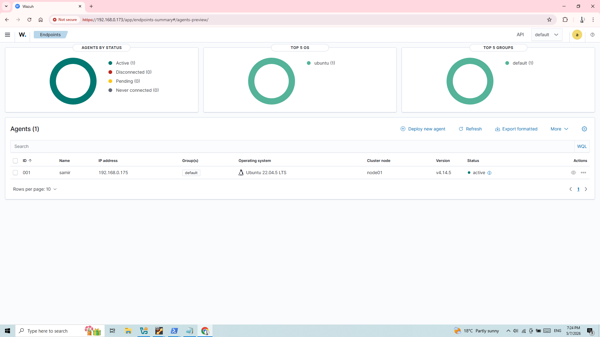
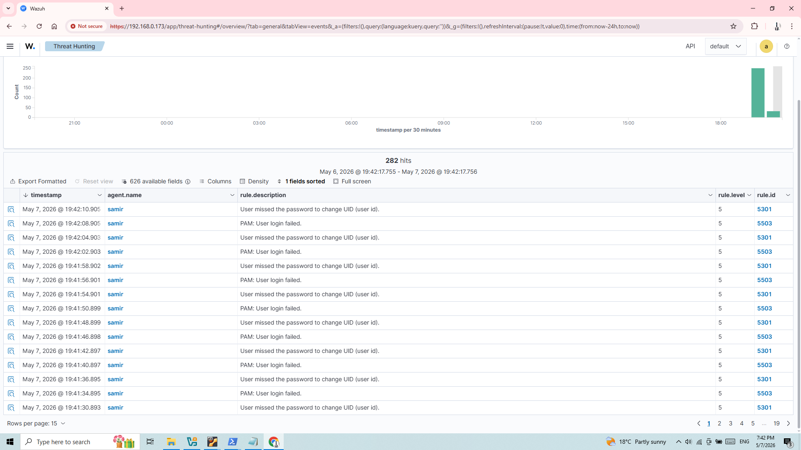
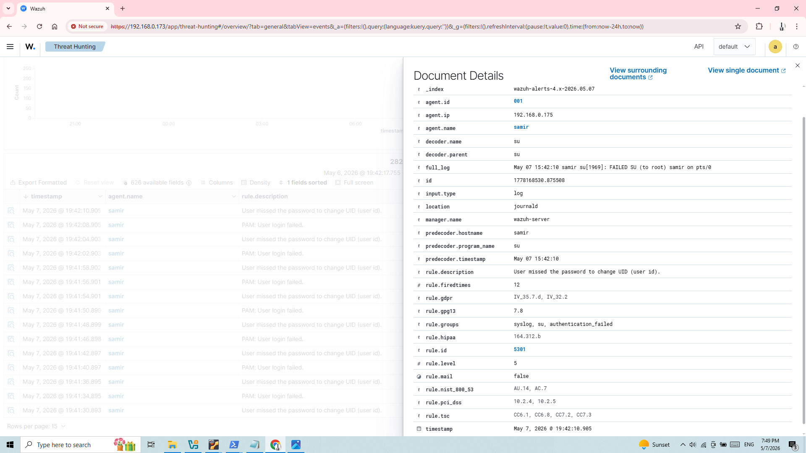

# Failed Authentication Detection Using Wazuh

## Project Description

Built a small SOC-style lab environment using Wazuh and Ubuntu Server in VirtualBox.

Configured an Ubuntu Server agent and connected it to the Wazuh server for centralized log monitoring and security event analysis.

Generated multiple failed authentication attempts to simulate suspicious login activity and investigated related security alerts through the Wazuh dashboard and threat hunting section.

Analyzed authentication-related Linux PAM logs, alert details, timestamps, source information, and event metadata within the Wazuh platform.

---

## Technologies and Tools Used

- Wazuh
- Ubuntu Server
- VirtualBox
- Linux PAM Logs

---

## Skills Demonstrated

- Security Monitoring
- Log Analysis
- Threat Hunting
- Authentication Event Investigation
- Linux Log Monitoring
- SIEM Fundamentals
- Virtual Lab Deployment

---

## Lab Screenshots

### 1. VirtualBox Environment with Ubuntu Server and Wazuh Virtual Machines Running

---

### 2. Active Ubuntu Agent Connected to Wazuh Server

---

### 3. Threat Hunting Logs Showing Failed Authentication Events

---

### 4. Detailed Wazuh Log Information for Failed Authentication Event

---

## Project Outcome

Successfully deployed a functional Wazuh monitoring environment capable of detecting and analyzing failed authentication attempts in a Linux-based system.

Validated alert generation, agent communication, and authentication event visibility through the Wazuh dashboard.
